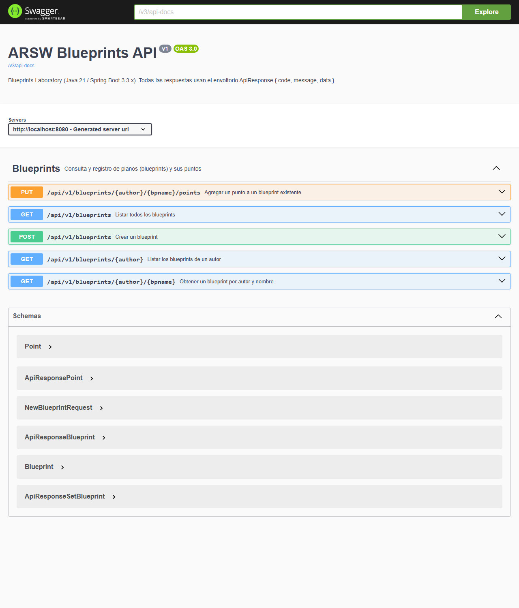

## Laboratorio – Parte 1: REST API Blueprints (Java 21 / Spring Boot 3.3.x)
# Escuela Colombiana de Ingeniería – Arquitecturas de Software

**Autores:** David Santiago Cajamarca Cadena y Sebastián González

API REST para gestionar planos (*blueprints*) y sus puntos, con persistencia en **PostgreSQL**, respuestas uniformes **ApiResponse\<T\>**, documentación **OpenAPI/Swagger** y filtros de puntos activables por perfiles de Spring.

---

## Requisitos
- Java 21
- Maven 3.9+
- Docker (para PostgreSQL)

## Ejecución del proyecto

1. Levantar PostgreSQL (crea la base **blueprints** con usuario/clave **blueprints**):
   ```bash
   docker compose up -d
   ```
   Si ya tienes un PostgreSQL local ocupando el puerto 5432, publica el contenedor en otro puerto y apunta la app a él:
   ```bash
   POSTGRES_PORT=5433 docker compose up -d
   DB_PORT=5433 mvn spring-boot:run
   ```
2. Ejecutar la aplicación:
   ```bash
   mvn spring-boot:run
   ```
   La conexión se configura en **src/main/resources/application.yml** y se puede sobrescribir con las variables **DB_HOST**, **DB_PORT**, **DB_NAME**, **DB_USER** y **DB_PASSWORD**. Las tablas se crean automáticamente (**spring.jpa.hibernate.ddl-auto=update**).

3. Activar un filtro de puntos (opcional):
   ```bash
   mvn spring-boot:run -Dspring-boot.run.profiles=redundancy
   mvn spring-boot:run -Dspring-boot.run.profiles=undersampling
   ```

## Pruebas
```bash
mvn test
```
Las pruebas no requieren PostgreSQL: usan H2 en memoria (perfil **test**).

| Clase | Qué verifica |
|-------|--------------|
| **BlueprintsAPIControllerTest** | Códigos HTTP (200/201/202/400/404) y envoltorio **ApiResponse** con MockMvc |
| **PostgresBlueprintPersistenceTest** | Contrato de **BlueprintPersistence** sobre JPA: guardar, duplicados, búsquedas, orden de puntos |
| **RedundancyFilterTest**, **UndersamplingFilterTest** | Lógica de los filtros |
| **BlueprintsSmokeTest** | El contexto de Spring arranca completo |

---

## Endpoints (**/api/v1/blueprints**)

| Método | Ruta | Éxito | Error |
|--------|------|-------|-------|
| GET | **/api/v1/blueprints** | **200 OK** | – |
| GET | **/api/v1/blueprints/{author}** | **200 OK** | **404** autor sin blueprints |
| GET | **/api/v1/blueprints/{author}/{bpname}** | **200 OK** (aplica el filtro activo) | **404** no existe |
| POST | **/api/v1/blueprints** | **201 Created** | **400** datos inválidos o ya existe |
| PUT | **/api/v1/blueprints/{author}/{bpname}/points** | **202 Accepted** | **404** no existe |

Todas las respuestas usan el mismo envoltorio:
```json
{
  "code": 200,
  "message": "OK",
  "data": { "author": "john", "name": "house", "points": [ { "x": 0, "y": 0 } ] }
}
```
En los errores **data** es **null** y **message** describe la causa.

Ejemplos con **curl** (la base inicia vacía, por eso primero se crea un blueprint):
```bash
curl -i -X POST http://localhost:8080/api/v1/blueprints -H 'Content-Type: application/json' \
  -d '{ "author":"john","name":"house","points":[{"x":0,"y":0},{"x":10,"y":0},{"x":10,"y":10}] }'
curl -i -X PUT http://localhost:8080/api/v1/blueprints/john/house/points -H 'Content-Type: application/json' \
  -d '{ "x":0,"y":10 }'
curl -s http://localhost:8080/api/v1/blueprints | jq
curl -s http://localhost:8080/api/v1/blueprints/john | jq
curl -s http://localhost:8080/api/v1/blueprints/john/house | jq
```

## Documentación y monitoreo
- Swagger UI: [http://localhost:8080/swagger-ui.html](http://localhost:8080/swagger-ui.html)
- OpenAPI JSON: [http://localhost:8080/v3/api-docs](http://localhost:8080/v3/api-docs)
- Actuator: [http://localhost:8080/actuator/health](http://localhost:8080/actuator/health), **/actuator/metrics**

## Evidencias
Generadas con la app corriendo contra PostgreSQL en Docker (carpeta [**docs/evidencias/**](docs/evidencias/)):

| Evidencia | Archivo |
|-----------|---------|
| Swagger UI con los 5 endpoints y los esquemas **ApiResponse\*** | [**swagger-ui.png**](docs/evidencias/swagger-ui.png) |
| Operación documentada (parámetros, ejemplos, respuestas 200/404) | [**swagger-ui-get-blueprint.png**](docs/evidencias/swagger-ui-get-blueprint.png) |
| Sesión completa de peticiones: 200/201/202/400/404 y filtros por perfil | [**api-requests.txt**](docs/evidencias/api-requests.txt) |
| Tablas **blueprints** y **points** consultadas con **psql** | [**postgres-blueprints.txt**](docs/evidencias/postgres-blueprints.txt) |



Para reproducir la consulta en base de datos:
```bash
docker exec -it blueprints-postgres psql -U blueprints -d blueprints \
  -c "SELECT b.author, b.name, p.position, p.x, p.y FROM blueprints b JOIN points p ON p.blueprint_id = b.id ORDER BY b.id, p.position;"
```

---

## Estructura (arquitectura por capas)

```
src/main/java/edu/eci/arsw/blueprints
  ├── model/         # Dominio: Blueprint, Point
  ├── dto/           # ApiResponse<T> (respuesta uniforme)
  ├── persistence/   # Interfaz BlueprintPersistence + InMemory y Postgres (JPA)
  │    └── entity/   # Entidades JPA y repositorio Spring Data
  ├── services/      # Lógica de negocio (BlueprintsServices)
  ├── filters/       # Identity, Redundancy, Undersampling (perfiles de Spring)
  ├── controllers/   # BlueprintsAPIController (/api/v1/blueprints)
  ├── exception/     # GlobalExceptionHandler (excepciones → códigos HTTP)
  └── config/        # OpenApiConfig
```
